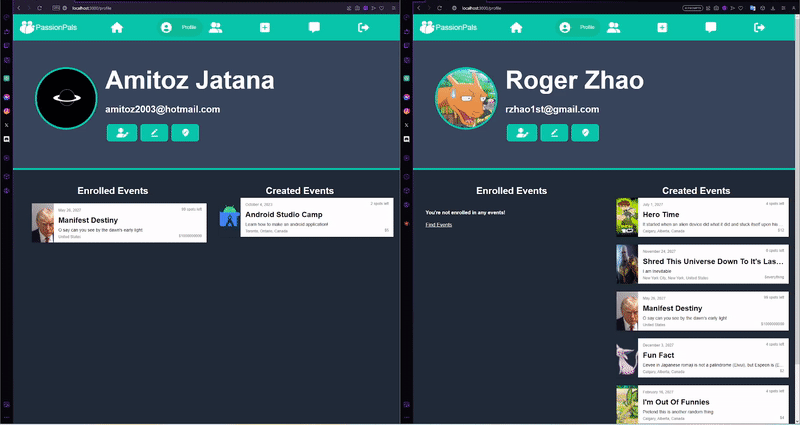
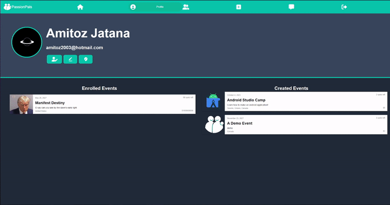
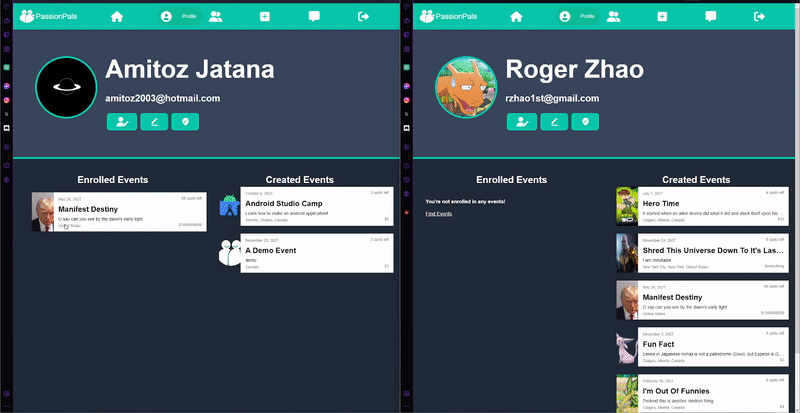
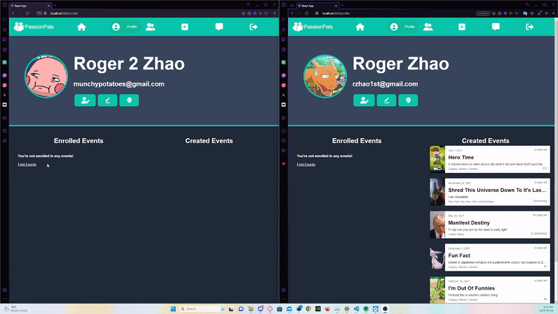
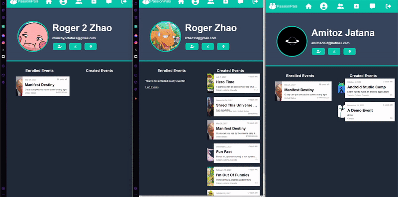

<p align="center">
  <a href="https://github.com/CSCC012023/final-project-s23-passion-pals">
    
  </a>
  <h2 align="center">PassionPals: Connecting People Based on Shared Passions</h2>
</p>

<details open="open">
  <summary><h2 style="display: inline-block">Table of Contents</h2></summary>
  <ol>
    <li>
      <a href="#about-the-project">About The Project</a>
      <ul>
        <li><a href="#built-with">Built With</a></li>
        <li><a href="#features">Features</a>
            <ul>
        		    <li><a href="#signup--login">Signup / Login</a></li>
                <li><a href="#waitlist">Waitlist</a></li>
                <li><a href="#find--filter--join-events">Find / Filter / Join Events</a></li>
                <li><a href="#create-event">Create Event</a></li>
                <li><a href="#edit-profile-and-events">Edit Profile and Events</a></li>
                <li><a href="#friends">Friends</a></li>
                <li><a href="#chat-with-friends">Chat With Friends</a></li>
                <li><a href="#group-chat-for-events">Group Chat for Events</a></li>
      		  </ul>
        </li>
      </ul>
    </li>
    <li>
      <a href="#getting-started">Getting Started</a>
      <ul>
        <li><a href="#installation">Installation</a></li>
        <li><a href="#contribution">Contributions</a></li>
      </ul>
    </li>
    <li><a href="#acknowledgements">Acknowledgements</a></li>
  </ol>
</details>

## About The Project

  <p align="left">
   Passion Pals is a platform designed to connect individuals based on their shared interests, passions, and desire to make new friends and have fun experiences. The motivation behind this project is to create a        space where like-minded people can connect, explore common interests, and participate in various events and activities together. Passion Pals aims to solve the problem of individuals wanting to meet new people       and expand their social circles by providing a platform that facilitates meaningful connections and enjoyable experiences.
   </br>
   </br>
   With Passion Pals you can:
   </br>
   - Post and join in events you are interested in.
   </br>
   - Create group chats for events, or direct message individuals you want to get to know!
   </br>
   - Subscribe to categories you are interested in and try new things.
  </p>

### Built With
 - MongoDB
 - Express.js
 - React.js
 - Node.js
 - HTML
 - CSS

### Features
 - #### Signup / Login
   
 - #### Waitlist

 - #### Find / Filter / Join Events
<p align="center">
  

 - #### Create event
<p align="center">
  

 - #### Edit Profile and Events
<p align="center">
    
 
 - #### Friends
<p align="center">
  
 
 - #### Chat With Friends
<p align="center">
  
 
 - #### Group Chat for Events
<p align="center">
  

## Getting Started
### Installation

Follow these steps to build and run the project:

0. To install this application you need the latest version of [Node.js](https://nodejs.org/en/download/)
1. Clone the repo
```
git clone https://github.com/CSCC012023/final-project-s23-passion-pals.git
```
2. Navigate to project directory
```
cd final-project-s23-passion-pals
```
3. Open three terminals. 
4. Using one navigate to the server package and initialize the backend
```
cd server
npm install
npm install socket.io
npm start
```
5. In the second, navigate to the client package and initialize the frontend
```
cd client
npm install
npm install socket.io-client timeago.js react-paginate
npm start
```
6. In the last one, navigate to the socket package and initialize the socket
```
cd socket
npm install
npm start
```

### Contribution
We are using git flow for this project. We name our branches based on the features being implemented and developed in the branch, such as "message" for developing a message system. Otherwise, we have the main branch and development. We are not using any public ticketing or issue website. We will be using pull requests.

## Acknowledgements
- [Amitoz Jatana](https://github.com/A-Jatana)
- [Abulimiti Musitapa](https://github.com/Mustafa0503)
- [Nicholas Louie](https://github.com/ExuApplePie)
- [Roger Zhao](https://github.com/zhaoroger)
- [Darren Trieu](https://github.com/Pyrunix)
- [Nishu Sheth](https://github.com/nishus24)
